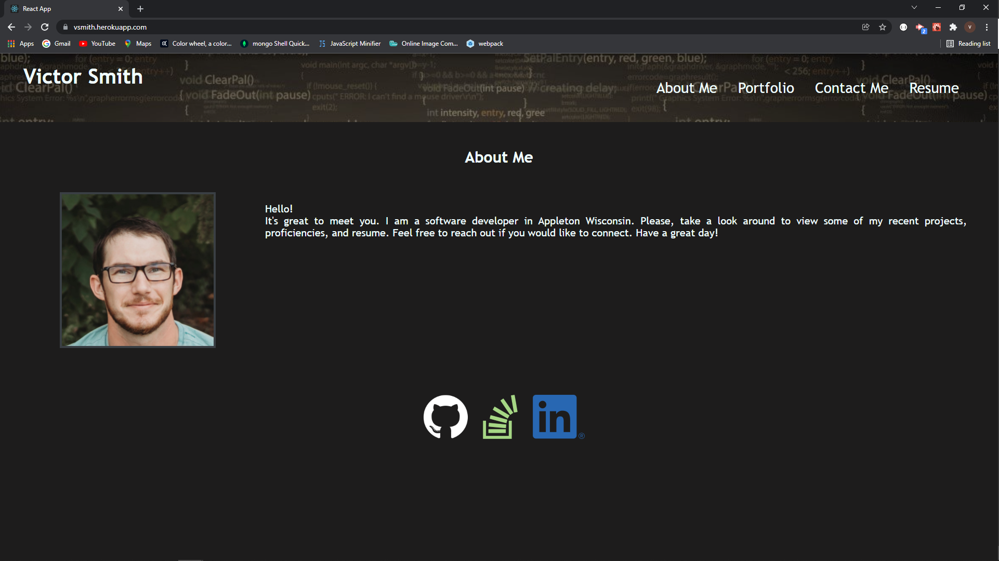

# Victor Smith Portfolio 

[Portfolio](https://vsmith.herokuapp.com/)

## Application Description
This is my personal portfolio with links to projects and my resume. The application was built using React and deployed with Heroku. 

## Table of Contents
* [Description](#application-description)
* [Installation](#installation)
* [Usage](#usage)
* [License](#license)
* [Contributions](#contributions)
* [Testing](#testing)
* [Questions](#questions)

## Installation
Use npm install to install packages.

## Usage
Free to use.

## License
N/A

## Contributions
You can contribute by creating a new issue.

## Testing
N/A

## Questions
Please feel free to reach out with any questions or concerns. I can be reached at victorj500@gmail.com or on GitHub at github.com/vic-smith.

